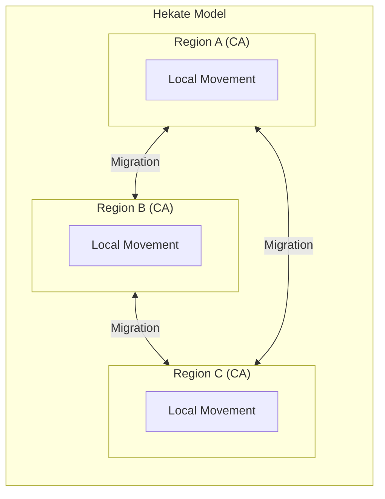

<div align="left">
  
  <p><em>Hekate — Spatial Migration Model</em></p>
</div>

# Hekate - Spatial Internal Migration Model

[](https://golang.org)
[](LICENSE)

> Named after Hekate, the Greek goddess of crossroads, boundaries, and transitions — fitting for a model that captures movement across space and between regions.

## Overview

Hekate is a **spatial model of internal migration** that simulates population movement at multiple scales. It combines:

- **Local movement** — handled by a cellular automata (CA) engine
- **Inter-regional movement** — between connected regional CA grids

Each region is represented as an independent cellular automaton, with migration occurring both locally within a region and between linked regions.

## Architecture



### Movement Types

1. **Local Movement** — Agents move within their current region based on CA transition rules (neighborhood interactions, suitability, etc.)

2. **Inter-regional Movement** — Agents can migrate between linked regions according to defined connectivity and push/pull factors

## Technology Stack

- **Backend**: Go (Golang) — high-performance concurrent simulation engine
- **Frontend**: Web-based interface for visualization and control

## Getting Started

### Prerequisites

- Go 1.21 or higher
- Web browser

### Installation

```bash
git clone https://github.com/yourusername/hekate.git
cd hekate
go mod download
```

### Running the Model

```bash
go run cmd/hekate/main.go
```

Navigate to `http://localhost:8080` in your browser.

## Configuration

[Hekate configuration details — define regions, connectivity, CA rules, etc.]

## Web Interface

[Web interface capabilities — visualize migration flows, CA grid states, parameter control, etc.]

## Roadmap

- [ ] Core CA implementation for local movement
- [ ] Region-to-region migration logic
- [ ] Web interface with live visualization
- [ ] Parameter tuning dashboard
- [ ] Export simulation results

## License

[MIT / Choose your license]

## Authors

[Your name / organization]
```

The Mermaid diagram now uses your preferred `flowchart LR` layout with the clean, minimal structure. You can customize the logo path, add more regions, or expand any section as needed.