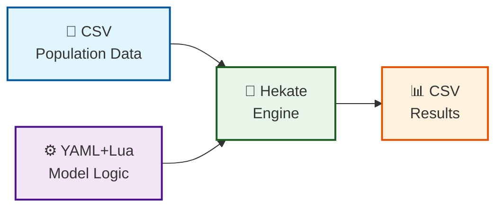

<div align="left">
  
  <p><em>Hekate — Microsimulation Engine</em></p>
</div>

# Hekate
## Microsimulation Engine

Named after the Greek goddess of crossroads, magic, and transitions, Hekate is a self-contained, dynamically configurable demographic microsimulation system written in Go. **Hekate is a general-purpose microsimulation engine** that can simulate population dynamics including migration, aging, mortality, fertility, and other demographic processes. The name reflects the engine's purpose—guiding populations through the crossroads of life events and demographic transitions.

---

## Why Hekate? Think NetLogo for Big Data

If you've used **NetLogo**, you already understand Hekate's philosophy:

| Feature | NetLogo | Hekate |
|---------|---------|--------|
| Single download, everything included | ✅ | ✅ |
| Easy to learn, shallow learning curve | ✅ | ✅ |
| Build models without programming experience | ✅ | ✅ |
| Rapid iteration: edit → run → see results | ✅ | ✅ |
| Domain-specific language (not general-purpose) | ✅ | ✅ |
| Built-in functions for common tasks | ✅ | ✅ |

**The Hekate Promise:** Like NetLogo, you can go from zero to a working model in minutes. Unlike NetLogo, Hekate can scale to millions or billions of individuals with minimal memory.

---

## How Hekate Works: Our Approach

### The Problem We're Solving

Traditional microsimulation systems have a fundamental problem: **to change how the model behaves, you need to change the source code and recompile.** This means:
- Only programmers can modify models
- Each change requires a new software release
- Models are locked inside compiled binaries
- Collaboration is difficult

### Our Solution: Models as Data

Hekate takes a different approach. **Models are defined as data, not code.** Here's how:



### What This Means for You

| Traditional Approach | Hekate Approach |
|----------------------|----------------|
| Model is code | Model is data (YAML + Lua) |
| Change = recompile | Change = edit text file |
| Programmers only | Anyone can modify |
| One model per release | Many models in one binary |
| Models are hidden | Models are transparent |
| Hard to share | Easy to share |

### The Three Components

**1. CSV Files: Your Population Data**

Your population is stored as a simple CSV file. Each row is one person, each column is a characteristic (age, sex, area, etc.). Hekate automatically detects your columns - no configuration needed!

**2. YAML + Lua: Your Model Instructions**

Your model is defined in a YAML file with embedded Lua scripts:
- **YAML** configures the simulation (iterations, file paths, etc.)
- **Lua** defines the logic (how people age, die, move, etc.)

The Lua scripts are the "brain" of your model. They tell Hekate what to do with your population.

**3. Hekate Engine: The Interpreter**

Hekate is a single, self-contained executable that:
- Reads your CSV population
- Reads your YAML model instructions
- Executes the Lua scripts on your population
- Produces CSV results

### Why This Works

**For Non-Programmers:**
- You only need to learn a few simple Lua concepts
- Models read like plain English
- No compilation, no complex setup

**For Researchers:**
- Rapid iteration: edit and rerun in seconds
- Full transparency: the model is visible in the config
- Easy collaboration: share config files, not code

**For Developers:**
- One binary for all models
- No dependency management
- Easy distribution

---

## Overview

Hekate is a **general-purpose microsimulation engine** that models population dynamics through individual-level simulation. Unlike traditional microsimulation systems that require code changes for each new model, Hekate uses:

- **Lua scripts** for model logic (flexible and readable)
- **YAML configuration** for model parameters, migration rates, and execution order
- **CSV files** for population data (works with any column structure)
- **Pure Go data structures** for in-memory processing (no external dependencies)

The result is a single, self-contained executable that can be distributed and run on any system without installation requirements. **Hekate can model a wide range of demographic processes** including migration, aging, mortality, fertility, education, income, household formation, and more.

---

## Built-in Statistical Functions

Hekate provides several powerful statistical functions that you can call directly from your Lua scripts. These functions are implemented in Go for performance and accuracy.

### Linear Regression: `hekate_stats.linear_predict()`

The `linear_predict()` function computes a linear combination: **y = intercept + coef₁×var₁ + coef₂×var₂ + ...**

**Syntax:**
```lua
local result = hekate_stats.linear_predict(
    intercept,    -- The constant term
    coef1, var1,  -- First coefficient-variable pair
    coef2, var2,  -- Second coefficient-variable pair
    ...           -- More pairs as needed
)
```

**Example: Predicting Income**
```lua
local income = hekate_stats.linear_predict(
    25000,        -- intercept: base income
    500, person.age,        -- age coefficient * age
    3000, edu_score,        -- education coefficient * education score
    -2000, gender_score     -- gender coefficient * gender score
)
```

**Common Use Cases:**
- **Income prediction**: Age, education, gender, occupation
- **Expenditure modeling**: Income, household size, region
- **Risk scoring**: Age, BMI, smoking status, chronic conditions
- **Utility calculations**: Multiple weighted factors

### Logistic Regression: `hekate_stats.logistic_predict()`

The `logistic_predict()` function computes a logistic probability: **p = 1 / (1 + e^(-linear))**

**Syntax:**
```lua
local probability = hekate_stats.logistic_predict(
    intercept,    -- The constant term
    coef1, var1,  -- First coefficient-variable pair
    coef2, var2,  -- Second coefficient-variable pair
    ...           -- More pairs as needed
)
```

**Example: Predicting Health Risk**
```lua
local risk = hekate_stats.logistic_predict(
    -3.5,         -- intercept
    1.2, age/10,  -- age coefficient * age in decades
    0.8, bmi_score,      -- BMI coefficient * BMI category
    1.5, smoker_score    -- smoking coefficient * smoker status
)
```

**Common Use Cases:**
- **Mortality risk**: Age, health status, smoking, chronic conditions
- **Disease probability**: Risk factors, genetics, lifestyle
- **Event likelihood**: Migration, marriage, employment
- **Binary outcomes**: Any yes/no prediction

### Linear Predict with Defaults: `hekate_stats.linear_predict_default()`

Handles missing values by substituting a default:

```lua
local result = hekate_stats.linear_predict_default(
    intercept,
    default_value,  -- Used when variables are nil
    coef1, var1, default1,  -- Coef, variable, default if nil
    coef2, var2, default2
)
```

### Why Use Go Functions Instead of Pure Lua?

| Aspect | Go Function | Pure Lua |
|--------|-------------|----------|
| **Performance** | ~10x faster | Slower |
| **Precision** | Double precision | Double precision |
| **Readability** | Clean function call | Complex math code |
| **Maintainability** | Centralized in Go | Scattered in scripts |
| **Error Handling** | Robust type checking | Manual checks needed |

---

## 🚀 New in Hekate: Streaming Mode for Large Populations

Hekate now features **Streaming Area-by-Area Processing**, enabling simulations with **millions to billions of individuals** using minimal memory!

### The Challenge We Solved

Traditional microsimulation systems load the entire population into memory. For large populations (10M+), this requires:
- 10-20 GB of RAM
- Expensive infrastructure
- Frequent out-of-memory errors

### Our Solution: Streaming Processing

Hekate now processes populations **area by area**, keeping only one area in memory at a time:

```
Traditional: Load ALL people → Process ALL → Save ALL (High Memory)
Streaming:   Load Area 1 → Process → Save → Load Area 2 → Process → Save → ... (Low Memory)
```

### Streaming Mode Benefits

| Feature | Traditional | Streaming Mode |
|---------|-------------|----------------|
| **Memory Usage** | 500MB - 20GB+ | ~20-50MB |
| **Maximum Population** | ~1-2M people | Unlimited |
| **Processing** | All at once | Area by area |
| **Speed** | Fast | Slightly slower but scalable |
| **Cost** | Expensive (big servers) | Cheap (any machine) |

### Performance with Streaming Mode

| Population | Memory | Time (5 years) | Time (50 years) |
|------------|--------|----------------|-----------------|
| 1M | ~20MB | 82 seconds | 13.7 minutes |
| 10M | ~20MB | 13.7 minutes | 2.3 hours |
| 50M | ~20MB | 1.1 hours | 11.4 hours |
| 100M | ~20MB | 2.3 hours | 22.8 hours |

**Key Insight:** Memory usage remains constant regardless of population size!

### How to Enable Streaming Mode

Add these lines to your `config.yaml`:

```yaml
simulation:
  streaming_mode: true      # Enable area-by-area processing
  area_column: "area_id"    # Column to group by (must be sorted)
  # ... other settings
```

**Important:** Your CSV must be **sorted by `area_column`** for streaming mode to work. All people in the same area must be together in the file.

### When to Use Streaming Mode

**Use Streaming Mode when:**
- Population > 1 million people
- Memory is limited (< 4GB)
- You have a large number of areas
- You want to run on low-cost hardware

**Use Traditional Mode when:**
- Population < 1 million people
- Memory is plentiful (> 8GB)
- Speed is the priority
- You're developing/testing models

---

## Tutorials

Get started with Hekate through our step-by-step tutorials. Each tutorial builds on the previous one, taking you from beginner to advanced user.

| Tutorial | Description | Level |
|----------|-------------|-------|
| [Tutorial 1: Building an Aging Model](tutorials/tutorial1_aging.md) | Learn the basics by creating a simple aging model. You'll create a population CSV, write your first configuration, run the simulation, and analyze the output. | ⭐ Beginner |
| [Tutorial 2: Understanding YAML and Adding Mortality](tutorials/tutorial2_yaml_mortality.md) | Dive deeper into YAML rules. Learn how to add a mortality model with age-specific death probabilities and track population changes. | ⭐⭐ Intermediate |
| [Tutorial 3: Adding Fertility](tutorials/tutorial3_fertility.md) | Complete the demographic cycle by adding fertility. Learn how to create new individuals (births), assign their characteristics, track population growth, and understand the full demographic cycle of aging, mortality, and fertility. | ⭐⭐⭐ Advanced |
| [Tutorial 4: Using Linear Regression in Hekate](tutorials/tutorial4_linear_regression.md) | **NEW!** Learn how to use Hekate's built-in linear regression function to predict income, health risk, and other continuous outcomes. Includes practical examples with income modeling and health risk prediction. | ⭐⭐⭐ Advanced |
| [Tutorial 5: Large-Scale Simulations with Streaming Mode](tutorials/tutorial5_streaming.md) | Learn how to use Hekate's streaming mode to simulate populations of millions to billions of people with minimal memory. Includes performance tuning, area-based processing, and best practices for large-scale runs. | ⭐⭐⭐⭐ Advanced User |

---

## Key Features

### General Microsimulation Capabilities
- **Age-Specific Models**: Different transition probabilities for different age groups
- **Flexible Model Logic**: Easily modify or add new models through YAML configuration
- **Priority-Based Execution**: Models run in specified priority order
- **Dynamic Data Handling**: Automatically detects and adapts to any CSV column structure
- **Built-in Statistical Functions**: Linear and logistic regression available in Lua scripts

### Streaming Mode
- **Memory-Efficient Processing**: Process populations of any size with ~20-50MB memory
- **Area-by-Area Processing**: Load, process, and save one area at a time
- **Scalable to Billions**: Population size limited only by disk space, not memory
- **Dual Mode Support**: Choose between streaming and traditional bulk processing

### General Features
- **Zero External Dependencies**: Pure Go implementation with embedded Lua - no C compiler, no external libraries required
- **Single Binary Deployment**: Build once, run anywhere (Linux, Windows, macOS)
- **Fully Dynamic Data Handling**: Automatically detects and adapts to any CSV column structure
- **Lua-Based Models**: Define complex demographic transitions using clean, readable Lua scripts
- **Parameter Substitution**: Use parameters like `{fertility_rate}` in Lua scripts for flexible configuration
- **Priority-Based Execution**: Models run in specified priority order
- **In-Memory Processing**: Fast, in-memory Go data structures for population data
- **Reproducible Results**: Fixed random seeds for consistent simulation outcomes

---

## Example Models

Hekate can model a wide range of demographic processes. Here are some examples:

### Migration Model
People move between areas based on age-specific probabilities. Young adults are most mobile, elderly are least mobile.

### Fertility Model
Women of childbearing age give birth based on age-specific fertility rates. Babies inherit characteristics from their mothers.

### Mortality Model
People die based on age-specific death probabilities. Mortality rates increase with age.

### Education Model
Children progress through primary, secondary, and tertiary education based on age.

### Income Model (Using Linear Regression)
People earn income based on age, education, and sex using the built-in `linear_predict()` function:

```lua
local income = hekate_stats.linear_predict(
    coefs.intercept,
    coefs.age, person.age,
    coefs.education, edu_score,
    coefs.gender, gender_score
)
```

### Health Risk Model (Using Logistic Regression)
Health risk is calculated using the built-in `logistic_predict()` function:

```lua
local risk = hekate_stats.logistic_predict(
    coefs.intercept,
    coefs.age, age / 10,
    coefs.bmi, bmi_score,
    coefs.smoker, smoker_score
)
```

### Household Formation Model
Young adults form new households, children live with their parents.

---

## Quick Start

### No Installation Required!

Hekate is distributed as pre-built executables for multiple platforms. **You don't need to install Go or compile anything** to use Hekate - just download the executable for your platform and run it.

### Prerequisites

- None! Just download the executable for your platform
- A text editor (VS Code, Sublime, Notepad++, etc.) for editing configuration files
- **Optional**: Go 1.21+ if you want to compile from source

### Important: Specify Your ID Column

Before running Hekate, make sure your `config.yaml` includes an `id_column`:

```yaml
simulation:
  id_column: "person_id"  # Replace with your ID column name
```

This column must exist in your population CSV and contain unique values for each individual.

### Important for Streaming Mode

If using streaming mode, your CSV must be **sorted by the area column**:

```yaml
simulation:
  streaming_mode: true
  area_column: "area_id"  # CSV must be sorted by this column
```

**How to sort your CSV:**
```bash
# On Linux/macOS
(head -n1 population.csv && tail -n+2 population.csv | sort -t, -k4 -n) > population_sorted.csv

# Or use the Python generator script (included)
python3 generate_population.py
```

### Download Pre-Built Binary

Pre-built executables are included in the release package. Choose your platform:

| Platform | Binary Name |
|----------|-------------|
| Linux (x86_64) | `hekate-linux-amd64` |
| Linux (ARM64) | `hekate-linux-arm64` |
| Windows (x86_64) | `hekate-windows-amd64.exe` |
| macOS (Intel) | `hekate-darwin-amd64` |
| macOS (Apple Silicon) | `hekate-darwin-arm64` |

```bash
# On Linux/macOS
chmod +x hekate-*
./hekate-linux-amd64 config.yaml

# On Windows
hekate-windows-amd64.exe config.yaml
```

### Run with Sample Data

```bash
# Make sure you have config.yaml and population.csv in the same directory
# Then run Hekate with your configuration
./hekate-linux-amd64 config.yaml
```

---

## Configuration

The system is entirely configured through a single YAML file:

### Simulation Parameters

```yaml
simulation:
  iterations: 10                    # Number of years to simulate
  population_file: "population.csv" # Input CSV file
  output_file: "output.csv"         # Output CSV file
  random_seed: 42                   # Fixed random seed for reproducibility
  verbose: true                     # Detailed logging output
  id_column: "person_id"            # REQUIRED: Primary key column for ordering
  area_column: "area_id"            # REQUIRED for streaming mode: Column to group by
  streaming_mode: true              # Enable streaming area-by-area processing
```

### Streaming Mode Settings

| Setting | Description | Default |
|---------|-------------|---------|
| `streaming_mode` | Enable area-by-area processing | `false` |
| `area_column` | Column to group by (must be sorted) | Required if streaming |

**When to use streaming mode:**
- Population > 1 million
- Limited memory available
- Large number of areas
- Running on low-cost hardware

### Model Definitions

Models define demographic transitions using Lua scripts. Here's an example with linear regression:

```yaml
models:
  - name: "income_predictor"
    type: "lua_model"
    priority: 2
    enabled: true
    parameters:
      coefficients:
        intercept: 25000
        age: 500
        education: 3000
      script: |
        function transition(population, params)
          local coefs = params.coefficients
          for _, person in ipairs(population) do
            if person.alive == true then
              local edu_score = 0
              if person.education == "tertiary" then
                edu_score = 2
              elseif person.education == "secondary" then
                edu_score = 1
              end
              
              person.income = hekate_stats.linear_predict(
                coefs.intercept,
                coefs.age, person.age,
                coefs.education, edu_score
              )
            end
          end
          return population
        end
```

---

## Input Data Format

The system accepts any CSV file with a header row. Column types are automatically detected:

### Required Columns
- `person_id`: Unique identifier (must match `id_column` in config)
- `age`: Age in years
- `area`: Current geographic area (integer or string)
- `alive`: Boolean indicating if individual is alive

### Recommended Columns
- `previous_area`: Previous geographic area (initialized to 0 or -1)

### ID Column

Hekate requires you to specify an **ID column** in the configuration. This column:
- Must contain unique values for each individual
- Is used as the PRIMARY KEY in the database
- Determines the order of rows in the output CSV

**Why is this required?** Hekate uses the ID column to ensure consistent ordering of output data, making it easier to compare results across different runs.

**Example:**
```yaml
simulation:
  id_column: "person_id"  # Must match a column in your CSV
```

If the ID column is not specified or doesn't exist in the CSV, Hekate will exit with an error.

### Sorting for Streaming Mode

**IMPORTANT:** For streaming mode to work, your CSV must be **sorted by `area_column`**:

```
area_id 1: person 1, person 2, person 3, ...
area_id 2: person 101, person 102, person 103, ...
area_id 3: person 201, person 202, person 203, ...
```

**How to sort your CSV:**

Using Python:
```python
import pandas as pd
df = pd.read_csv('population.csv')
df_sorted = df.sort_values('area_id')
df_sorted.to_csv('population_sorted.csv', index=False)
```

Using command line (Linux/macOS):
```bash
(head -n1 population.csv && tail -n+2 population.csv | sort -t, -k4 -n) > population_sorted.csv
```

### Example CSV
```csv
person_id,age,sex,area_id,alive,previous_area
1,25,F,1,true,0
2,30,M,1,true,0
3,45,F,1,true,0
4,68,M,2,true,0
5,82,F,2,true,0
```

---

## Output

### CSV Output
The final population state is saved as CSV with all columns preserved, including:
- Original columns (person_id, age, sex, area, alive)
- Migration history (previous_area)
- Additional columns added by models

**Note:** The output CSV is always ordered by the ID column specified in the configuration.

### Intermediate Files (Streaming Mode)
When running in streaming mode, Hekate creates intermediate files for each year:

```
year_0.csv  → Initial population (input)
year_1.csv  → After year 1
year_2.csv  → After year 2
year_3.csv  → After year 3
...
final_output.csv → Copy of last year's file
```

These files allow you to:
- Resume simulations from any year
- Check intermediate results
- Debug models more easily

---

## Performance Benchmarks

### Streaming Mode (Memory-Efficient)

| Population | Memory | Time/Year | 50 Years |
|------------|--------|-----------|----------|
| 1M | ~20MB | 16.4 sec | 13.7 min |
| 10M | ~20MB | 2.7 min | 2.3 hours |
| 50M | ~20MB | 13.7 min | 11.4 hours |
| 100M | ~20MB | 27.3 min | 22.8 hours |

*Benchmarks on Intel Xeon 24-core, 64GB RAM, SSD*

### Key Insight
**Memory usage remains constant regardless of population size!** This means Hekate can simulate populations of **any size** on standard hardware.

### Traditional Mode (Speed-Optimized)

| Population | Memory | Time/Year | 50 Years |
|------------|--------|-----------|----------|
| 100K | ~200MB | 3 sec | 2.5 min |
| 1M | ~2GB | 30 sec | 25 min |

*Use traditional mode for populations < 1M where speed is the priority*

---

## Troubleshooting

### Common Issues

**"ERROR: id_column is required in simulation section of config.yaml"**
- Add `id_column: "your_id_column"` to the `simulation` section in config.yaml
- Make sure the column name matches exactly with your CSV header

**"ERROR: area_column is required when streaming_mode is true"**
- Add `area_column: "your_area_column"` to the `simulation` section
- Make sure the column exists in your CSV

**"ID column 'person_id' not found in CSV header"**
- Check that the column name in `id_column` matches your CSV header exactly
- Available columns are listed in the error message
- Example: If your CSV has `id` instead of `person_id`, use `id_column: "id"`

**"Failed to load population"**
- Check CSV file path and format
- Ensure CSV has a header row
- Verify all rows have the same number of columns
- Make sure `id_column` matches a column in the CSV

**"Failed to execute Lua script"**
- Check Lua syntax in the model definition
- Verify your script defines a `transition(population, params)` function
- Make sure column names in the script match your CSV

**"attempt to compare number with string"**
- Use `tonumber()` to convert string values to numbers
- Example: `local age = tonumber(person.age) or 0`

**Binary won't run on target system**
- Build for the target platform: `GOOS=linux GOARCH=amd64 go build`
- Check architecture compatibility: `file hekate`

**"Permission denied" on Linux/macOS**
- Make the binary executable: `chmod +x hekate-*`

**Streaming mode is slow or memory usage is high**
- Ensure CSV is properly sorted by `area_column`
- Check that `area_column` has reasonable cardinality (100+ areas recommended)

---

## Compiling from Source

**Note:** This section is optional. Pre-built executables are included in the release package. You only need to compile from source if you want to modify the code or build for a platform not included.

### Prerequisites for Compilation

- Go 1.21 or later
- Git (optional)

### Step 1: Install Go (if not already installed)

**Ubuntu/Debian:**
```bash
sudo apt update
sudo apt install golang-go
# Or install latest version
wget https://go.dev/dl/go1.21.5.linux-amd64.tar.gz
sudo tar -C /usr/local -xzf go1.21.5.linux-amd64.tar.gz
export PATH=$PATH:/usr/local/go/bin
```

**macOS:**
```bash
brew install go
```

**Windows:**
Download and install from https://go.dev/dl/

### Step 2: Clone or Create Project

```bash
# Clone the repository
git clone https://github.com/your-repo/hekate.git
cd hekate

# Or create a new project
mkdir hekate
cd hekate
```

### Step 3: Get Dependencies

```bash
# Initialize Go module
go mod init hekate

# Get dependencies (pure-Go Lua, no CGO needed)
go get github.com/yuin/gopher-lua
go get gopkg.in/yaml.v3

# Tidy dependencies
go mod tidy
```

### Step 4: Compile

**Compile for Current Platform:**
```bash
go build -o hekate main.go
```

**Compile for Specific Platforms:**

| Target Platform | Command |
|-----------------|---------|
| Linux (x86_64) | `GOOS=linux GOARCH=amd64 go build -o hekate-linux-amd64 main.go` |
| Linux (ARM64) | `GOOS=linux GOARCH=arm64 go build -o hekate-linux-arm64 main.go` |
| Windows | `GOOS=windows GOARCH=amd64 go build -o hekate-windows-amd64.exe main.go` |
| macOS (Intel) | `GOOS=darwin GOARCH=amd64 go build -o hekate-darwin-amd64 main.go` |
| macOS (Apple Silicon) | `GOOS=darwin GOARCH=arm64 go build -o hekate-darwin-arm64 main.go` |

**Compile for All Platforms at Once:**

Create a `Makefile`:

```makefile
.PHONY: all linux windows mac linux-arm mac-arm

all: linux windows mac linux-arm mac-arm

linux:
	GOOS=linux GOARCH=amd64 go build -o hekate-linux-amd64 main.go

linux-arm:
	GOOS=linux GOARCH=arm64 go build -o hekate-linux-arm64 main.go

windows:
	GOOS=windows GOARCH=amd64 go build -o hekate-windows-amd64.exe main.go

mac:
	GOOS=darwin GOARCH=amd64 go build -o hekate-darwin-amd64 main.go

mac-arm:
	GOOS=darwin GOARCH=arm64 go build -o hekate-darwin-arm64 main.go

clean:
	rm -f hekate-*
```

Then run:
```bash
make all
```

### Step 5: Verify Compilation

**Check Binary:**
```bash
# Check file type
file hekate-linux-amd64

# Check for dynamic dependencies (should show no external libraries)
ldd hekate-linux-amd64  # On Linux
otool -L hekate-darwin-amd64  # On macOS

# Check binary size
ls -lh hekate-*
```

**Test Run:**
```bash
./hekate-linux-amd64 config.yaml
```

### Step 6: (Optional) Install System-Wide

**Linux/macOS:**
```bash
sudo cp hekate-linux-amd64 /usr/local/bin/hekate
sudo chmod +x /usr/local/bin/hekate

# Now run from anywhere
hekate config.yaml
```

**Windows:**
Add the directory containing `hekate-windows-amd64.exe` to your PATH, or rename to `hekate.exe` and place in a convenient location.

---

## Population Generator Script

Hekate includes a Python script to generate test populations:

```python
# generate_population.py
python3 generate_population.py
```

This generates:
- 1 million people (configurable)
- Sorted by area for streaming mode
- Realistic demographic distributions
- Family relationship placeholders

**Customization:**
```python
# In generate_population.py
total_people = 10_000_000  # 10 million
num_areas = 100            # 100 areas
```

---

## Extending Hekate

### Adding New Models

1. Edit `config.yaml`:

```yaml
models:
  - name: "my_new_model"
    type: "lua_model"
    priority: 3
    enabled: true
    description: "My custom model"
    parameters:
      rate: 0.01
      script: |
        function transition(population, params)
          for _, person in ipairs(population) do
            if person.alive == true then
              -- Your model logic here
            end
          end
          return population
        end
```

2. No code changes required!

### Adding New Features

Hekate is designed to be extensible. To add new features:

1. **New Lua Functions**: Register new Go functions in `NewLuaVM()`
2. **New Configuration Options**: Add fields to `SimulationParameters`
3. **New Output Formats**: Add new writer functions

---

## Get Help from AI with the LLM Prompt Template

Writing Hekate models is easy, but sometimes you need a little help getting started. We've created an **LLM Prompt Template** that you can copy and paste into any AI assistant (ChatGPT, Claude, etc.) to get help writing your models.

### How It Works

1. **Copy** the [LLM Prompt Template](LLM_PROMPT_TEMPLATE.md)
2. **Paste** it into your preferred AI assistant
3. **Describe** what you want to build
4. **Get** working YAML and Lua code

### What the Template Includes

The template provides the AI with:
- **Context**: What Hekate is and how it works
- **Examples**: Working models for aging, mortality, fertility, migration, education, and income
- **Templates**: Ready-to-use YAML configuration templates
- **Structure**: The exact format needed for Hekate models

### Example Questions You Can Ask

Once you've pasted the template into your AI assistant, you can ask:

- "I want to add a model where people get married. Women marry at age 20-30, men at 22-35."
- "I need a fertility model where fertility rates vary by age: 15-19: 2%, 20-24: 8%, 25-29: 10%, 30-34: 8%, 35-39: 4%, 40-44: 1%"
- "I want migration to depend on distance between areas."
- "I need a household formation model where young adults leave their parents' household."

### Get the Template

📄 **[Download the LLM Prompt Template](LLM_PROMPT_TEMPLATE.md)** - Copy and paste this into your AI assistant!

---

## License

MIT License - See LICENSE file for details.

## Authors

Nik Lomax  
Alison Heppenstall  
Hugh Rice  
Andreas Hoehn  
Ric Colasanti
